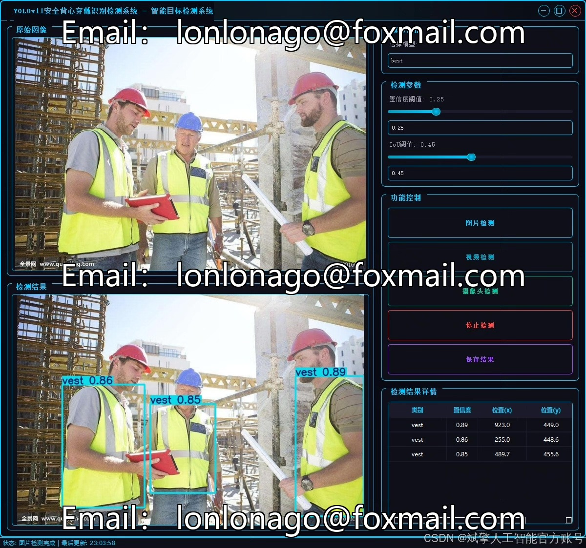
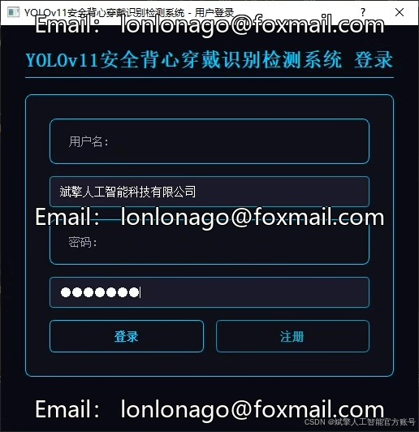
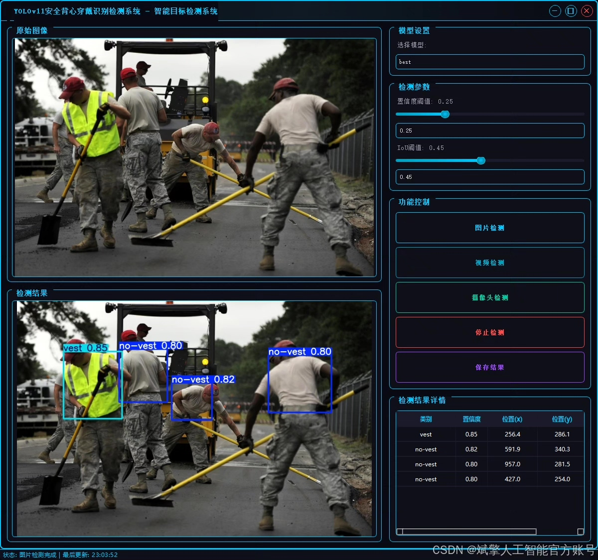
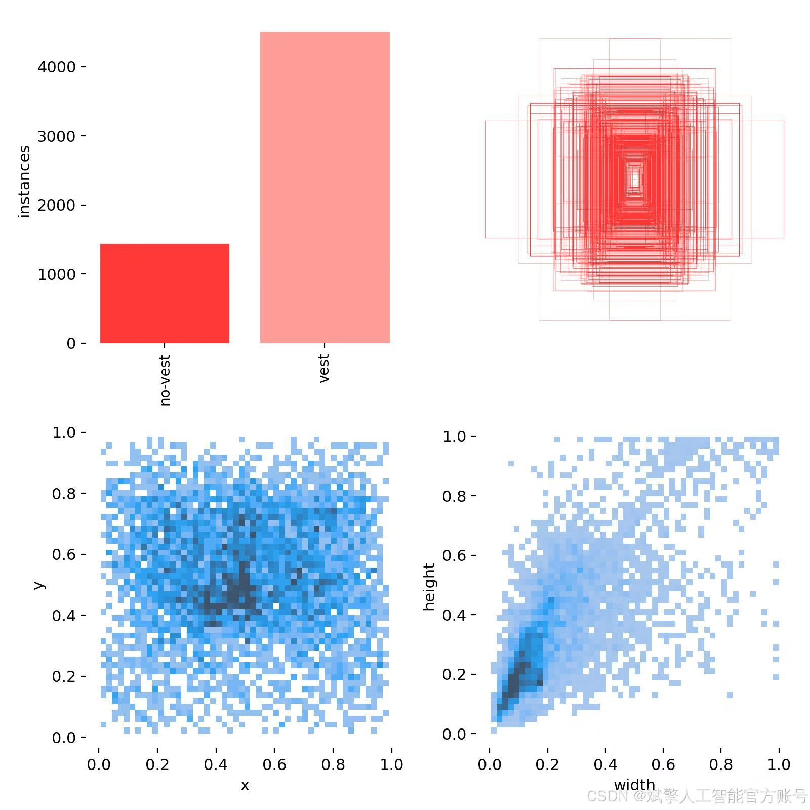
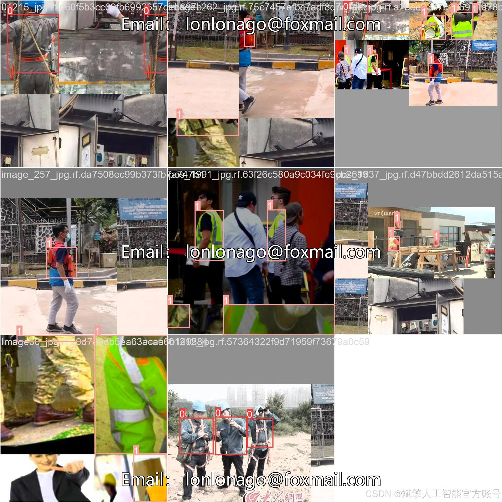
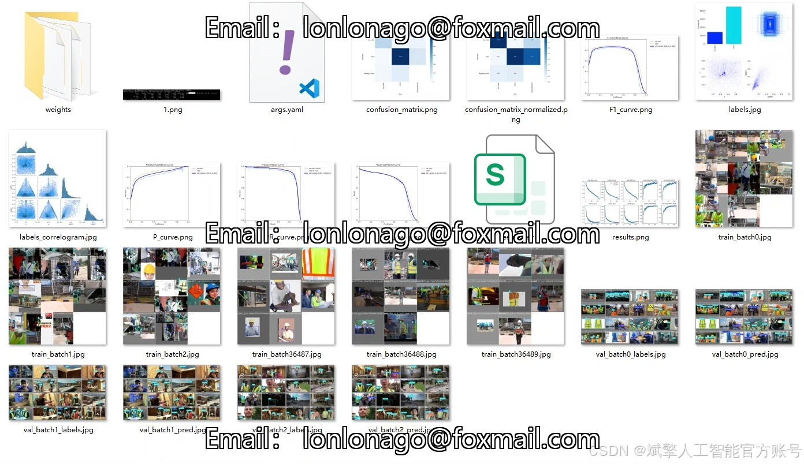
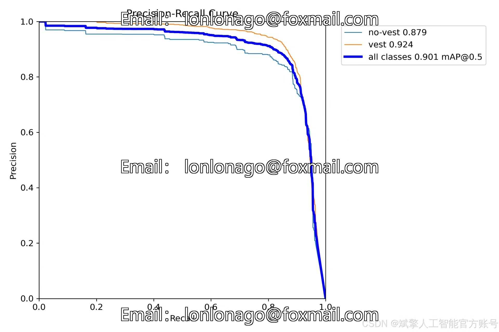
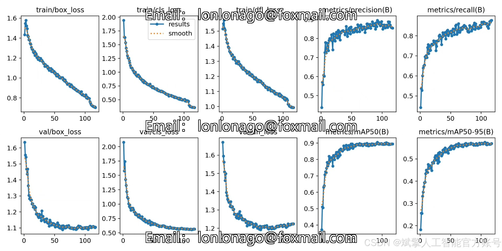
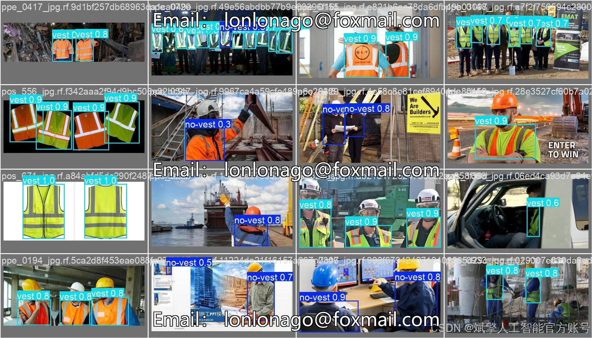

# Based on deep learning YOLOv11, a security vest wearing detection system for YOL

## Body

Based on deep learning YOLOv11, a safety vest wearing detection system for security vests (YOLOv11+YOLO dataset + UI interface + login registration interface + Python project source code + model)

This paper designs and implements a deep learning-based safety vest wearing detection system for work personnel. The goal is to automatically detect whether workers are properly wearing safety vests in construction sites, factories, and other scenarios, thereby enhancing the efficiency of safety management. The system employs an improved YOLOv11 object detection algorithm, combined with a custom YOLO format dataset (containing 2728 training images, 779 validation images, and 390 test images, covering "vest" and "no-vest" categories), achieving high precision and real-time safety vest detection. The system integrates a user-friendly UI interface, supporting login and registration functions, facilitating multi-role tiered management. Experiments show that the system achieves an mAP of 90.1% on the test set, with frame rates exceeding 45 FPS, meeting practical deployment requirements.

✅ User login registration: Supports password verification and security validation.
✅ Three detection modes: Based on the YOLOv11 model, supports image, video, and real-time camera detection, accurately identifying targets.
✅ Dual-screen comparison: Displays original images and detection results side by side.
✅ Data visualization: Real-time table displays the category, confidence, and coordinates of detected targets.
✅ Intelligent parameter adjustment: Offers a confidence slide bar to dynamically optimize detection accuracy, adapting to different scene needs.
✅ Sci-fi style interaction interface: Dark theme paired with dynamic light effects, reducing visual fatigue and improving operational experience.

## Images

## Payment

Here is a pay link on Stripe ( https://buy.stripe.com/3cs8yP7sY87d0vu9AB ). Please contact me lonlonago@foxmail.com after funding $89, and I will send you a complete data files , thank you!

